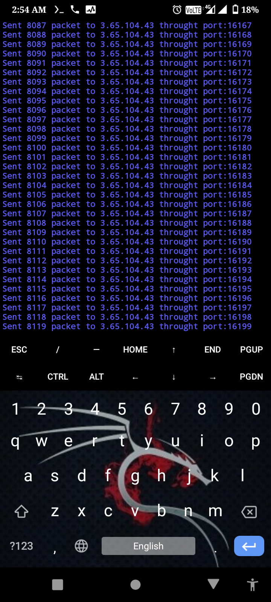

# Assalamualaikum 🥰
# Ddos Attack
* Created by Md Nazmul Islam
* Don't Try to decompile or edit this tool.
* This tool for DDos Attack in any website by Termux.
* Use this only for educational purpose.
* Don't try this in Bangladeshi site.
* I can't responsible for any misuse.Use this at your own risk.

# Installation Command:
* pkg update
* pkg upgrade
* pkg install python
* pkg install python2
* pkg install git
* git clone https://github.com/DARK-NI/DDos-Attack
* cd DDos-Attack
* python2 ddos.py

* Tool's Username:ddos
* Tool's Password:NAZMUL

</img>

* Join our Facebook Group:https://facebook.com/groups/spamming.termux.learning.point/
* Tnx all ❣️❣️

